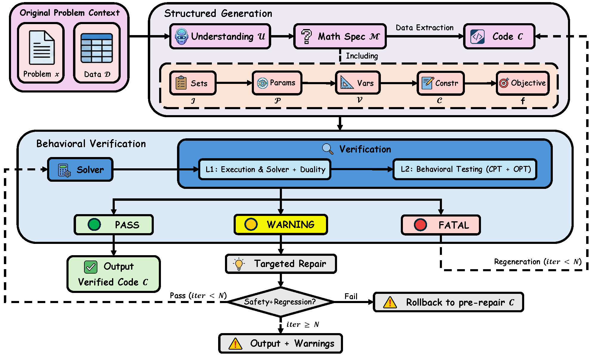
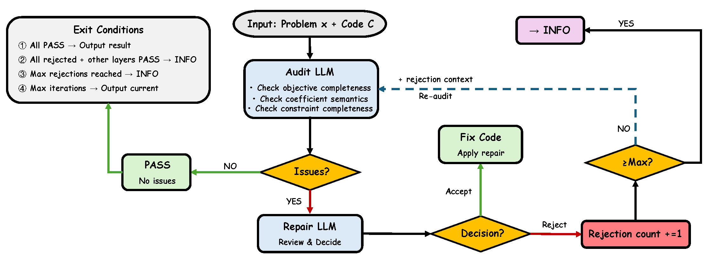

# ReLoop: Detecting Silent Failures in LLM-Generated Optimization Code via Behavioral Verification

[](https://www.python.org/downloads/)
[](https://opensource.org/licenses/MIT)
[]()

This repository contains the official implementation of the paper:

> **ReLoop: Detecting Silent Failures in LLM-Generated Optimization Code via Behavioral Verification**
>
> Junbo Jacob Lian, Yujun Sun, Huiling Chen, Chaoyu Zhang, Chung-Piaw Teo
>
> arXiv preprint, 2026

---

## Related Resources

| Resource | Link | Description |
|----------|------|-------------|
| **RetailOpt-190 Dataset** | [Hugging Face](https://huggingface.co/datasets/Jacoblian/RetailOpt-190) | Download dataset directly |
| **RetailOpt-190 Repository** | [GitHub](https://github.com/junbolian/RetailOpt-190) | Dataset details, prompt generation, universal solver |

The **RetailOpt-190** benchmark is a key contribution of this paper, featuring:
- 190 retail inventory optimization scenarios with varying complexity
- Natural language problem descriptions with ground-truth optimal solutions
- Prompt generation scripts and universal Gurobi solver implementation

---

## Overview

ReLoop is a behavioral verification framework that detects **silent failures** in LLM-generated optimization code—code that executes successfully but produces incorrect results. Our key insight is that correct optimization models satisfy fundamental mathematical invariants (execution correctness, direction consistency, constraint presence) that can be tested without ground truth.

**Key Results:**
- 94% detection rate for silent failures
- 3% false positive rate on correct code
- No ground truth required for verification

---

## Framework Architecture



### Key Components

| Component | Description |
|-----------|-------------|
| **Chain-of-Thought Generation** | 3-stage structured generation: Understand → Formalize (with variable type reasoning) → Synthesize |
| **L1 Execution & Solver** | Syntax, runtime, and solver status checks with IIS/unbounded diagnostics (FATAL → regeneration) + duality check (INFO) |
| **L2 Direction Consistency** | LLM-based adversarial debate between verify and repair roles with Accept/Reject |
| **L3 Constraint Presence Test** | LLM-based verification of expected constraints in generated code (CPT) |
| **Unified Diagnostic Schema** | All layers output `Diagnostic` objects; unified `build_repair_prompt()` assembles repair prompts |
| **Diagnostic-Based Repair** | Conservative strategy: only ERROR/WARNING trigger repair, INFO is reference only |
| **Repair Safety Guardrails** | Prevents repair LLM from modifying input data or introducing dangerous operations |
| **Repair Regression Guard** | Post-repair rollback if repaired code crashes or status degrades vs pre-repair baseline |

### Design Principles

1. **Universal Verification**: All checks work without ground truth or domain-specific rules
2. **Conservative Repair**: Only high-confidence issues (ERROR/WARNING) trigger repairs
3. **Robustness Guarantee**: L1 FATAL triggers regeneration; L2-L3 are diagnostic only
4. **LLM-Only Analysis**: No keyword-based heuristics; all semantic analysis uses LLM
5. **Repair Safety**: Repair code is validated before execution; data variable cannot be reassigned
6. **Regression Guard**: Repair never makes results worse — rollback on crash or status degradation

### Generation: Chain-of-Thought (CoT)

A single LLM call with 3-stage structured reasoning (`generation.py`, `prompts.py`):

1. **Understand** — Identify objective (min/max), decisions, constraints, parameters
2. **Formalize** — Write the mathematical model: sets, parameters, decision variables (with explicit CONTINUOUS/INTEGER/BINARY type reasoning), constraints, objective
3. **Synthesize** — Generate executable Gurobi Python code

The code receives a pre-defined `data` dict (schema only, not values in the prompt) and must not redefine it. Big-M values must be computed dynamically from data, never hardcoded.

### L1: Execution Verification (Blocking Layer)

Checks whether generated code executes and produces a valid solution (`verification.py:_layer1`).

**Sequential checks:**

| Step | Check | On Failure |
|------|-------|------------|
| L1.1 | Syntax (AST parse) | FATAL |
| L1.2 | Runtime execution | FATAL (with stderr) |
| L1.3 | Solver status | See below |
| L1.4 | Duality gap (add-on) | INFO only |

**L1.3 Solver status handling:**

| Status | Severity | Action | Diagnostics |
|--------|----------|--------|-------------|
| INFEASIBLE | FATAL | Regenerate | IIS constraint names + conflicting bounds |
| UNBOUNDED | FATAL | Regenerate | Unbounded variable rays (`InfUnbdInfo=1`) |
| TIMEOUT (no solution) | FATAL | Regenerate | — |
| OPTIMAL / feasible | PASS | Continue | — |

**L1.4 Duality check** — After OPTIMAL, compute relative primal-dual gap:
- Gap > 1%: INFO (likely numerical artifact, no repair)
- Gap <= 1%: PASS

**FATAL handling:** Triggers regeneration (up to `max_regeneration_attempts=3`). The LLM receives the failed code and error message to generate corrected code.

### L2: Direction Consistency Analysis (Adversarial)



Detects parameters whose objective response contradicts expected behavior (`l2_direction.py`, `pipeline.py:_run_l2_adversarial_loop`).

**Procedure:**

1. **Perturb** — For each numeric parameter, perturb by +delta and -delta (default delta=10%), re-solve, record `z_plus` and `z_minus`
2. **LLM_verify** (temperature=0) — Single batched LLM call analyzes all parameters:
   - Input: parameter name, current value, baseline objective, +delta% objective change, -delta% objective change
   - Output per parameter: `param_role` (constraint_bound / objective_coef / other), `expected_direction`, `is_violation`, `confidence` (0.0-1.0)
3. **LLM_repair** (temperature=0.3) — For each violation with confidence >= 0.5, repair LLM decides:
   - **Accept** — Agrees with diagnosis, provides fixed code
   - **Reject** — Disagrees with diagnosis, provides rejection reason
   - Higher temperature encourages diverse reasoning for the adversarial "devil's advocate" role
4. **Re-analysis** — Rejected parameters are re-analyzed with rejection context (up to `max_rejections=2` per parameter)

**Exit conditions:**

| Condition | Exit Reason | Severity |
|-----------|-------------|----------|
| No violations found | `all_pass` | PASS |
| All violations rejected + L1/L3 PASS | `all_rejected_others_pass` | INFO |
| Max rejections reached for all params | `max_rejections` (downgrade) | INFO |
| Some accepted, code fixed | `accepted_fixed` | ERROR (triggers repair) |
| Max L2 iterations (3) reached | `max_iterations` | ERROR |

**Perturbation modes** (auto-detected per problem):
- `data_dict` — Perturb values in the data dictionary
- `source_code` — Perturb hardcoded values in generated code
- `hybrid` — Try data_dict first, fall back to source_code if no effect

### L3: Constraint Presence Test (CPT, Optional)

Tests whether expected constraints are actually active in the generated model (`verification.py:_layer3`). Enabled by `--enable-cpt`.

**Procedure:**

1. **Extract candidates** — LLM reads problem description, outputs candidate constraints with type (capacity / demand / balance) and related parameters
2. **Perturb and re-solve** — For each candidate, apply extreme perturbation to related parameter:

   | Constraint Type | Perturbation | Rationale |
   |----------------|-------------|-----------|
   | Capacity | x 0.001 (near-zero) | If capacity constraint exists, near-zero capacity should drastically change objective |
   | Demand | x 100 (scale up) | If demand constraint exists, extreme demand should cause infeasibility or large change |
   | Other | x 0.01 (1%) | General extreme perturbation |

3. **Grade by change ratio** — `change_ratio = |new_obj - baseline| / |baseline|`

   | Change Ratio | Severity | Meaning |
   |-------------|----------|---------|
   | < 5% | WARNING | Constraint likely **missing** (triggers repair) |
   | 5% - 30% | INFO | Uncertain (no repair) |
   | > 30% | PASS | Constraint is **present** |
   | INFEASIBLE | PASS | Constraint is active (extreme perturbation caused infeasibility) |

### Diagnostic-Based Repair

All layers output unified `Diagnostic` objects with severity and evidence (`verification.py:Diagnostic`, `pipeline.py`).

**Severity-to-action mapping:**

| Severity | Source | Action |
|----------|--------|--------|
| FATAL | L1 execution errors | Regenerate code (not repair) |
| ERROR | L2 accepted direction violations | **Must fix** — included in repair prompt |
| WARNING | L3 CPT missing constraints | **Should fix** — included in repair prompt |
| INFO | L1 duality, L2 rejected, L3 uncertain | **Reference only** — shown but not fixed |

**Repair loop** (`pipeline.py`, budget `N=3`):
1. Collect all diagnostics → `build_repair_prompt()` assembles prompt with actionable issues (ERROR/WARNING) and reference context (INFO)
2. LLM generates repaired code
3. **Safety guardrail** (`repair_safety.py`) — Validates repair code before execution:
   - Blocks: `data = {...}` (reassignment), `data["key"] = val` (mutation), dangerous imports (`os`, `subprocess`)
   - Exception: `data = json.loads(...)` is allowed (re-parses existing data)
   - On violation: 1 guided retry (does not consume repair budget); 2nd failure → keep original code
4. Re-verify repaired code
5. **Regression guard** — Compare post-repair result against pre-repair baseline:
   - Crash regression: objective was not None → now None
   - Status regression: status rank decreased (VERIFIED=3 > WARNINGS=2 > ERRORS=1 > FAILED=0)
   - On regression: **rollback** to pre-repair code and stop all further repair
6. Repeat until: no actionable diagnostics, no change, regression detected, or budget exhausted

---

## Installation

```bash
git clone https://github.com/junbolian/ReLoop.git
cd ReLoop
pip install -r requirements.txt
```

### Requirements

- Python >= 3.8
- Gurobi >= 9.0 (with valid license)
- numpy
- (Optional) LLM API access for L2/L3 layers

```bash
# Verify installation
python -c "from reloop import ReLoopVerifier; print('OK')"
```

---

## Quick Start

ReLoop uses the OpenAI Python SDK, so any **OpenAI-compatible API** works out of the box (OpenAI, vLLM, Ollama, llama.cpp server, LiteLLM, etc.).

Set environment variables and run:

```bash
export OPENAI_API_KEY="your-api-key"
export OPENAI_BASE_URL="http://localhost:8000/v1"   # your API endpoint

python run_ablation.py \
    -d data/RetailOpt-190.jsonl \
    -m gpt-4.1 \
    --enable-cpt \
    --workers 5 \
    -v
```

Results are saved to `experiment_results/<dataset-name>/<model>/`:
- `ablation_report.csv` — per-problem objectives and pass/fail at each verification stage
- `chat_logs.jsonl` — full LLM conversation logs

### CLI Parameters

| Flag | Default | Description |
|------|---------|-------------|
| `-d, --dataset` | *(required)* | Path to dataset JSONL file |
| `-m, --model` | `gpt-4.1` | Model name (passed to OpenAI SDK) |
| `--base-url` | `$OPENAI_BASE_URL` | Override API base URL (alternative to env var) |
| `-o, --output-dir` | `experiment_results/<dataset>/<model>` | Custom output directory |
| `--enable-cpt` | off | Enable L3 Constraint Presence Test |
| `--workers` | 20 | Number of concurrent workers |
| `--no-cot` | off | Skip Chain-of-Thought, use direct generation |
| `--no-verify` | off | Skip all verification (execute generated code only) |
| `-v, --verbose` | off | Print verbose logs to stdout |

### Python API

For programmatic usage:

```python
from reloop import run_reloop, DataExtractor

llm_client = YourLLMClient()  # must implement generate(prompt, system=None) -> str

extractor = DataExtractor(llm_client)
data = extractor.extract("Minimize cost with capacity 500 and demands [100, 150, 200]...")

result = run_reloop(
    problem_description="...",
    data=data,
    llm_client=llm_client,
    verbose=True
)

print(f"Status: {result.final_report.status}")  # VERIFIED, WARNINGS, ERRORS, FAILED
print(f"Objective: {result.final_report.objective}")
```

---

## Available Datasets

| Dataset | # Problems | Avg Tokens | Description |
|---------|:---:|:---:|-------------|
| `RetailOpt-190.jsonl` | 190 | 2,900 | **Our benchmark** - Retail optimization scenarios |
| `IndustryOR_fixedV2.jsonl` | 100 | 267 | Industry OR problems with difficulty labels |
| `MAMO_EasyLP_fixed.jsonl` | 642 | — | Easy LP problems |
| `MAMO_ComplexLP_fixed.jsonl` | 203 | 459 | Complex LP problems |

**Prompt format:** All datasets use data-embedded format (full data in prompt) for evaluation.
RetailOpt additionally provides schema-based prompts where the LLM sees only data schema (keys, types, dimensions), and actual values are injected at runtime via the `data` dict — this is the format used by ReLoop's verification pipeline.

---

## Compared Models

| Type | Model | Source |
|------|-------|--------|
| Foundation LLM | Claude Opus 4.5 | Anthropic |
| Foundation LLM | DeepSeek-V3.1 | DeepSeek |
| Foundation LLM | Qwen3-32B | [Qwen Team, 2025](https://qwenlm.github.io/blog/qwen3/) |
| Offline SFT | OptMATH-Qwen2.5-32B | [Zhou et al., 2025](https://arxiv.org/abs/2502.11102) |
| Online RL | SIRL-Qwen2.5-32B | [Kong et al., 2025](https://arxiv.org/abs/2505.11792) |

---

## Experiment Results

### Table 1: Main Results on RetailOpt-190

| Type | Model | Exec% ||| Acc% pass@1 (ε=10⁻⁴) ||| Acc% pass@1 (ε=10⁻²) |||
|------|-------|:---:|:---:|:---:|:---:|:---:|:---:|:---:|:---:|:---:|
| | | Base | CoT | ReLoop | Base | CoT | ReLoop | Base | CoT | ReLoop |
| Foundation | Claude Opus 4.5 | | | | | | | | | |
| Foundation | DeepSeek-V3.1 | 63.2 | 51.1 | **76.3** | 5.3 | 11.6 | **17.9** | 9.5 | 15.3 | **22.1** |
| Foundation | Qwen3-32B | | | | | | | | | |
| Offline SFT | OptMATH-Qwen2.5-32B | — | | | — | | | — | | |
| Online RL | SIRL-Qwen2.5-32B | — | | | — | | | — | | |

### Table 2: Cross-Benchmark Generalization (Acc% pass@1, ε=10⁻⁶)

| | | MAMO-ComplexLP ||| IndustryOR |||
|------|-------|:---:|:---:|:---:|:---:|:---:|:---:|
| Type | Model | Base | CoT | +ReLoop | Base | CoT | +ReLoop |
| Foundation | Claude Opus 4.5 | | | | | | |
| Foundation | DeepSeek-V3.1 | 60.6 | 62.1 | **63.5** | 44.0† | 58.0 | **60.0** |
| Foundation | Qwen3-32B | 46.9† | | | 61.9† | | |
| Offline SFT | OptMATH-Qwen2.5-32B | 54.1† | — | | 31.0† | — | |
| Online RL | SIRL-Qwen2.5-32B | 61.1† | — | | 42.0† | — | |

† Cited from SIRL (Kong et al., 2025) and StepORLM (Zhou et al., 2025).

### Table 3: Ablation (Claude Opus 4.5 × RetailOpt-190)

| Config | Exec% | Acc% pass@1 (ε=10⁻⁴) | Acc% pass@1 (ε=10⁻²) |
|--------|:---:|:---:|:---:|
| Direct | | | |
| +CoT | | | |
| +CoT+L1 | | | |
| +CoT+L1+L2 | | | |
| +CoT+L1+L2+L3 | | | |

---

## Appendix Tables

### Table A1: Per-Family Breakdown on RetailOpt-190 (Acc% pass@1, ε=10⁻⁴)

| Family | #Inst | Claude Opus 4.5 || DeepSeek-V3.1 || Qwen3-32B || OptMATH-32B || SIRL-32B ||
|--------|:---:|:---:|:---:|:---:|:---:|:---:|:---:|:---:|:---:|:---:|:---:|
| | | Base | +ReLoop | Base | +ReLoop | Base | +ReLoop | Base | +ReLoop | Base | +ReLoop |
| F1 Core Ops | 20 | | | 0.0 | **40.0** | | | | | | |
| F2 Assort & Sub | 30 | | | 6.7 | **20.0** | | | | | | |
| F3 Resource | 20 | | | 0.0 | **10.0** | | | | | | |
| F4 Demand Dyn | 30 | | | 3.3 | **6.7** | | | | | | |
| F5 Feasibility | 20 | | | 5.0 | **15.0** | | | | | | |
| F6 Discrete Log | 20 | | | 5.0 | **5.0** | | | | | | |
| F7 Network & ME | 30 | | | 6.7 | **16.7** | | | | | | |
| F8 Omni-channel | 20 | | | 15.0 | **35.0** | | | | | | |
| **Total** | **190** | | | **5.3** | **17.9** | | | | | | |

### Table A2: Tiered Tolerance on RetailOpt-190 (Acc% pass@1)

| Model | ε=10⁻⁴ || ε=10⁻² || ε=5×10⁻² || ε=10⁻¹ ||
|-------|:---:|:---:|:---:|:---:|:---:|:---:|:---:|:---:|
| | Base | +ReLoop | Base | +ReLoop | Base | +ReLoop | Base | +ReLoop |
| Claude Opus 4.5 | | | | | | | | |
| DeepSeek-V3.1 | 5.3 | **17.9** | 9.5 | **22.1** | 14.7 | **31.1** | 27.4 | **45.3** |
| Qwen3-32B | | | | | | | | |
| OptMATH-Qwen2.5-32B | | | | | | | | |
| SIRL-Qwen2.5-32B | | | | | | | | |

### Table A3: Verification Layer Statistics (Claude Opus 4.5 × RetailOpt-190)

| Layer | Trigger Type | Count | Repair Success% |
|-------|-------------|:---:|:---:|
| L1 | Runtime Error | | |
| L1 | Infeasible | | (IIS-enhanced) |
| L1 | Unbounded | | (Ray diagnosis) |
| L1 | Timeout | | |
| L2 | Direction Violation | | |
| L3 | Missing Constraint | | |
| L3 | Uncertain Constraint | | |
| — | Undetected (silent) | | (detection boundary) |

---

## Ablation Study

The ablation study measures each verification layer's marginal contribution. The pipeline records intermediate checkpoints during a single run:

| Checkpoint | What it captures | Pipeline state |
|------------|-----------------|----------------|
| **CoT** (baseline) | Raw generated code execution | Before any verification |
| **L1** | After L1 verify + FATAL regeneration | Before L2 adversarial |
| **L2** | After L2 direction consistency analysis | Before diagnostic repair |
| **Final** | After full repair loop (L1+L2+L3 diagnostics) | Complete pipeline |

### Running ablation experiments

`run_ablation.py` records all checkpoints automatically (see [Quick Start](#quick-start) for full CLI usage):

```bash
python run_ablation.py -d data/RetailOpt-190.jsonl -m <model> --enable-cpt --workers 5 -v
```

### Analyzing layer contributions

```bash
python analyze_layers.py experiment_results/RetailOpt-190/<model>/ablation_report.csv
```

Output includes:
- Pass counts at each stage (auto-detected tolerance: ε=10⁻⁴/10⁻² for RetailOpt, ε=10⁻⁶ for cross-benchmark)
- Layer transitions: fail→pass (helped) vs pass→fail (hurt) per layer
- Crash recovery statistics
- Net contribution summary per layer

### Checkpoint design

The `PipelineResult` dataclass includes `l1_checkpoint_obj/status` and `l2_checkpoint_obj/status` fields, recorded automatically during `pipeline.run()`:

1. **L1 checkpoint**: Recorded after L1 verification and FATAL regeneration loop (Step 3). Captures L1's contribution through crash recovery via code regeneration.
2. **L2 checkpoint**: Recorded after L2 adversarial loop (Step 4). Captures L2's additional contribution through direction consistency repair.
3. **Final**: The standard pipeline output after the full diagnostic-based repair loop (Step 5), which processes diagnostics from all enabled layers.

---

## Project Structure

```
reloop/
├── reloop/                       # Core package
│   ├── __init__.py               # Public API exports
│   ├── param_utils.py            # Parameter extraction & perturbation (data-dict)
│   ├── perturbation.py           # Source-code level perturbation (AST-based) + mode detection
│   ├── executor.py               # Isolated subprocess execution with IIS/unbounded diagnostics
│   ├── verification.py           # 3-layer verification engine (L1-L3) + unified Diagnostic schema
│   ├── l2_direction.py           # L2 Direction Consistency Analysis (adversarial LLM debate)
│   ├── prompts.py                # LLM prompt templates
│   ├── generation.py             # Code generation
│   ├── repair.py                 # Diagnostic-based repair with L2 Accept/Reject
│   ├── repair_safety.py          # Repair safety guardrails (data protection, import blocking)
│   ├── pipeline.py               # Pipeline orchestration (with ablation checkpoints)
│   ├── data_extraction.py        # NL → structured data extraction
│   └── experiment_runner.py      # Batch experiment runner
├── tests/                        # Test suite
│   ├── test_perturbation.py      # Unit tests for perturbation module
│   ├── test_e2e_perturbation.py  # E2E tests for L2 perturbation modes
│   ├── test_repair_safety.py     # Unit tests for repair safety guardrails
├── data/                         # Benchmark datasets (JSONL)
├── fig/                          # Architecture diagrams
│   ├── Reloop_framework.png      # System architecture diagram
│   └── L2.png                    # L2 Direction Consistency Analysis diagram
├── run_ablation.py               # Ablation experiment runner (per-layer contribution)
├── analyze_layers.py             # Layer contribution analysis from ablation CSV
├── requirements.txt              # Python dependencies
├── pyproject.toml                # Project configuration
├── LICENSE                       # MIT License
└── README.md                     # This file
```

---

## API Reference

### Core Classes

| Class | Description |
|-------|-------------|
| `ReLoopVerifier` | 3-layer verification engine |
| `Diagnostic` | Unified diagnostic schema for all layers |
| `L2DirectionVerifier` | L2 Direction Consistency Analysis with LLM adversarial debate |
| `CodeGenerator` | Generate Gurobi code from problem description |
| `CodeRepairer` | Repair code based on diagnostics (with L2 Accept/Reject) |
| `ReLoopPipeline` | Complete generate→verify→repair pipeline |
| `DataExtractor` | Extract structured data from natural language |
| `ExperimentRunner` | Run batch experiments on datasets |

### Verification

```python
from reloop import ReLoopVerifier, verify_code

# Quick verification
report = verify_code(code, data)

# With CPT (requires LLM)
verifier = ReLoopVerifier(llm_client=llm)
report = verifier.verify(
    code, data,
    problem_description="...",
    enable_cpt=True
)

# Report fields
report.status      # 'VERIFIED' | 'WARNINGS' | 'ERRORS' | 'FAILED'
report.objective   # float (always present if L1 passes)
report.confidence  # 0.0 - 1.0
report.layer_results  # List[LayerResult]
```

### Pipeline

```python
from reloop import ReLoopPipeline, run_reloop

# Using class (full control)
pipeline = ReLoopPipeline(
    llm_client,
    max_repair_iterations=3,        # L2-L3 repair attempts
    max_regeneration_attempts=3,    # L1 FATAL regeneration attempts
    enable_cpt=True,                # Enable L3 CPT layer
    enable_l2_adversarial=True,     # Enable L2 Direction Consistency Analysis
    use_structured_generation=True  # Use 3-stage pipeline
)
result = pipeline.run(problem_description, data)

# Using convenience function
result = run_reloop(
    problem_description, data, llm_client,
    max_iterations=3,          # Repair iterations
    max_regenerations=3,       # Regeneration attempts
    use_structured_generation=True
)

# Result fields
result.final_code         # str
result.final_report       # VerificationReport
result.iterations         # int (total verification iterations)
result.success            # bool
result.regeneration_count # int (L1 FATAL regenerations)
```

### Data Extraction

```python
from reloop import DataExtractor

extractor = DataExtractor(llm_client)
data = extractor.extract("""
    Factory has capacity 500 units.
    Product costs: $10, $15, $8.
    Demands: 100, 150, 200.
""")
# Returns: {"capacity": 500, "cost": [10, 15, 8], "demand": [100, 150, 200]}
```

### Experiments

```python
from reloop import ExperimentRunner, run_experiment

runner = ExperimentRunner(llm_client, output_dir="results")
summary = runner.run_dataset("data/RetailOpt-190.jsonl")

# Summary fields
summary.total_problems
summary.verified_count
summary.detection_rate
summary.false_positive_rate
summary.repair_success_rate
summary.avg_objective_error
summary.by_difficulty  # Dict[str, Dict]
```

---

## Chain-of-Thought Code Generation

ReLoop uses **Chain-of-Thought (CoT)** 3-stage generation:

```
Problem → [STEP 1: Understand] → [STEP 2: Formalize] → [STEP 3: Code] → Output
                    ↓                    ↓                   ↓
              (same context)      (same context)      (same context)
```

**Formalization Stage — Variable Type Reasoning:**

The formalization step explicitly prompts the LLM to determine variable types (CONTINUOUS, INTEGER, or BINARY) for each decision variable by analyzing physical context. For example, "number of trucks" implies integer, while "volume of liquid" implies continuous. This reduces downstream variable type errors.

**Generation Approaches:**

| Approach | Description | Error Rate |
|----------|-------------|------------|
| Single-Stage | Direct problem → code (baseline) | - |
| 3-Stage CoT (single call) | All steps in one prompt | 2.17% |
| 3-Stage CoT (separate calls) | 3 API calls (loses context) | 10.85% |

**Recommended:** 3-Stage CoT with single API call (preserves reasoning chain)

---

## Data Input Modes

ReLoop supports two data input modes for code generation. Both produce code that accesses data via `data["key"]` at runtime.

| Mode | LLM Sees | Use Case |
|------|----------|----------|
| **Data-embedded** | Full data values in prompt | Benchmark evaluation (all experiments in this paper) |
| **Schema-based** | Schema only (keys, types, dimensions) | Industrial deployment (data too large or sensitive for prompt) |

**Data-embedded mode** (used for all benchmark evaluations):
- The complete data dict is embedded directly in the problem prompt
- LLM sees actual values and generates code accordingly
- Simpler and more reliable for fixed-size benchmark problems

**Schema-based mode** (for production deployment):
- LLM sees only schema descriptions (e.g., `capacity: int`, `costs: list[3] of int`)
- Actual data values are injected at runtime via the `data` dict
- Enables deployment on large-scale or confidential datasets where embedding full data in the prompt is impractical

**Code Design Principle:** Regardless of input mode, generated code must use `data["key"]` to access data at runtime. The `data` dict is injected by the executor, and repair prompts also include data context to ensure consistency.

**Big-M Guidelines (for indicator/logical constraints):**
- NEVER hardcode Big-M values like `M = 1e6`
- ALWAYS compute M dynamically: `M = sum(data["demand"]) * 1.5`
- Use problem-relevant parameters for M calculation

---

## 3-Layer Verification Architecture

| Layer | Name | Type | Description |
|-------|------|------|-------------|
| L1 | Execution & Solver + Duality | Blocking | Syntax, runtime, solver status with IIS/unbounded diagnostics → triggers regeneration on FATAL; duality check as add-on diagnostic (INFO) |
| L2 | Direction Consistency Analysis | Diagnostic | LLM-based adversarial direction verification with Accept/Reject |
| L3 | Constraint Presence Test (CPT) | Enhancement | LLM-based constraint testing (WARNING/INFO) |

**Severity Levels (Conservative Repair Strategy):**

| Severity | Confidence | Source | Repair Action |
|----------|------------|--------|---------------|
| `FATAL` | 100% | L1 only | Triggers regeneration (up to 3 attempts) |
| `ERROR` | 99%+ | L2 direction (accepted) | **MUST fix** |
| `WARNING` | 80%+ | L3 cpt_missing | **SHOULD fix** |
| `INFO` | <80% | L1 duality, L2 (rejected/inconclusive) | **DO NOT fix** (reference only) |
| `PASS` | - | All layers | No action needed |

**Key Design Principle:**
- Only ERROR and WARNING trigger repair
- INFO is for reference only - likely normal optimization behavior (slack constraints, numerical artifacts)
- This prevents over-correction that was causing ReLoop to perform worse than baseline

### Perturbation Modes (Source-Code vs Data-Dict)

L2 and L3 perform parameter perturbation to test model behavior. ReLoop supports two perturbation strategies with automatic detection:

| Mode | Detection Criterion | Perturbation Strategy | Typical Datasets |
|------|---------------------|-----------------------|------------------|
| `data_dict` | Code uses `data["key"]` pattern | Perturb the data dict values (existing) | RetailOpt-190 |
| `source_code` | Code hardcodes numeric values, no `data[` access | Perturb via AST-based code rewriting | IndustryOR, MAMO |
| `hybrid` | Both patterns present | Try data-dict first; fallback to source-code if no effect | Mixed |

**Auto-Detection:** `detect_perturbation_mode(code, data)` inspects the generated code for `data[` access patterns and counts hardcoded numeric assignments. The result determines which perturbation strategy L2-L3 use.

**Source-Code Perturbation Flow:**
```
LLM Code:    capacity = 500; demand = 300
                     ↓ AST Parse
Extract:     [{name: "capacity", value: 500, access_path: "capacity"}, ...]
                     ↓ perturb_code(code, "capacity", 1.2)
Perturbed:   capacity = 600; demand = 300
                     ↓ Execute
Objective:   Compare with baseline to detect anomalies
```

**Hybrid Fallback:** For `hybrid` mode, L2-L3 first try data-dict perturbation. If the perturbed objective is unchanged (parameter hardcoded in code rather than read from data), the system falls back to AST-based source-code perturbation.

**Key Design Constraint:** The detection/judgment logic (thresholds, direction analysis, CPT thresholds) is completely unchanged. Only the perturbation mechanism is extended.

### L2: Direction Consistency Analysis (LLM-based Adversarial)

L2 uses an **adversarial mechanism** where two LLM roles debate to converge on the correct analysis:

```
┌─────────────────────────────────────────────────────────────┐
│                 L2 Adversarial Flow                          │
├─────────────────────────────────────────────────────────────┤
│                                                             │
│  LLM_verify ──→ "Parameter X should decrease objective"     │
│       │                                                     │
│       ▼                                                     │
│  LLM_repair ──→ Accept? ──→ YES ──→ ERROR (must fix)       │
│       │              │                                      │
│       │              └──→ NO (Reject) ──→ Re-analyze        │
│       │                        │                            │
│       │                        ▼                            │
│       │              LLM_verify (with rejection feedback)   │
│       │                        │                            │
│       │                        ▼                            │
│       │              [Repeat until Accept or max rejections]│
│       │                                                     │
│       └──→ Max rejections reached ──→ INFO (inconclusive)  │
│                                                             │
└─────────────────────────────────────────────────────────────┘
```

**Exit Conditions (forces output):**
1. `all_pass`: No violations found → output
2. `all_rejected_others_pass`: All L2 rejected + L1/L3 PASS → output (INFO level)
3. `max_rejections`: Max rejections per param reached (default 2) → downgrade to INFO → output
4. `max_iterations`: Reached max L2 iterations (default 3) → output
5. `accepted_fixed`: Some accepted, code fixed → re-verify and continue

**Key Parameters:**
- `max_l2_rejections`: Max times a param can be rejected before downgrade (default: 2)
- `max_l2_iterations`: Max L2 loop iterations (default: 3)

> **Design Principle:** The adversarial mechanism allows two LLM perspectives to debate.
> This is more reliable than single-LLM analysis because errors get caught by the other role.
> Keyword-based direction verification has been completely removed.

**Robustness Guarantee:**
- L1 `FATAL` triggers regeneration, not immediate termination
- L2-L3 are diagnostic only: never block output
- L2 loop always exits with output (one of the exit conditions will be met)
- False positives don't affect result values (objective/solution always returned if L1 passes)
- INFO-level issues do NOT trigger repair (prevents over-correction)

### L3: CPT (Constraint Presence Testing)

L3 uses **LLM-based constraint extraction** to identify expected constraints, then tests if they are present in the generated code:

```
┌─────────────────────────────────────────────────────────────┐
│                 L3 CPT Flow                                  │
├─────────────────────────────────────────────────────────────┤
│                                                             │
│  Problem Description ──→ LLM Extract Constraints            │
│                              │                              │
│                              ▼                              │
│               Candidate Constraints List                    │
│               [protein_min, carbs_min, ...]                 │
│                              │                              │
│                              ▼                              │
│         For each constraint: Extreme Perturbation           │
│         (e.g., scale demand 100x, capacity to 0.001)        │
│                              │                              │
│                              ▼                              │
│         Measure Objective Change Ratio                      │
│              < 5%  → WARNING (likely missing)               │
│            5-30%   → INFO (uncertain)                       │
│              > 30% → PASS (constraint present)              │
│                                                             │
└─────────────────────────────────────────────────────────────┘
```

**Threshold-Based Detection:**

| Change Ratio | Severity | Interpretation |
|--------------|----------|----------------|
| < 5% | **WARNING** | Constraint likely missing - extreme perturbation had no effect |
| 5-30% | INFO | Uncertain - may be partially active |
| > 30% | PASS | Constraint present - perturbation significantly affected objective |

**Example Output:**
```
[L3] CPT
  Extracted 3 candidates:
  ├─ [MISSING] minimum protein requirement - 0.0% change
  ├─ [UNCERTAIN] minimum carbs requirement - 21.1% change
  └─ [PRESENT] minimum calories requirement - 38.0% change
```

### L1: IIS and Unbounded Diagnostics

When the solver returns **INFEASIBLE**, L1 automatically computes the **Irreducible Inconsistent Subsystem (IIS)** using Gurobi, identifying the minimal set of conflicting constraints:

```
[L1] INFEASIBLE - IIS Analysis:
  Conflicting constraints:
    - demand_1 (> 100.0)
    - supply_1 (< 50.0)
  Conflicting variable bounds:
    - x UB=10
```

For **UNBOUNDED** models, L1 reports the unbounded ray variables:

```
[L1] UNBOUNDED - Ray Analysis:
  Unbounded variables:
    - x (ray=1.0000)
    - y (ray=0.5000)
```

**Implementation:** The executor uses an `exec()` + `try/except` wrapper (not `atexit`) to run IIS diagnostics while the Gurobi model is still alive in memory.

### Unified Diagnostic Schema

All verification layers output results in a unified `Diagnostic` format:

```python
@dataclass
class Diagnostic:
    layer: str          # "L1", "L2", "L3"
    issue_type: str     # "INFEASIBLE", "DIRECTION_VIOLATION", "MISSING_CONSTRAINT", "SPEC_VIOLATION", etc.
    severity: str       # "ERROR", "WARNING", "INFO"
    target_name: str    # Which parameter/constraint
    evidence: str       # Auto-generated evidence description
    triggers_repair: bool  # Whether this triggers repair
```

The repair pipeline collects `Diagnostic` objects from all layers and uses `build_repair_prompt()` to assemble a structured repair prompt with:
- **Actionable issues** (triggers_repair=True): listed with full evidence
- **Reference items** (triggers_repair=False): shown as context only, explicitly marked "DO NOT FIX"

### Repair Safety

ReLoop enforces safety guardrails on repair LLM outputs to prevent data corruption:

| Check | Method | What it catches |
|-------|--------|----------------|
| Data reassignment (dict literal) | AST + Regex | `data = {...}` (fabricated data) |
| Data reassignment (other) | AST | `data = some_function()` (unknown source) |
| Data mutation | AST + Regex | `data["key"] = value`, `data["key"] += value` |
| Dangerous imports | Regex | `import os`, `import subprocess` |

Note: `data = json.loads(...)` is **allowed** — it re-parses existing data rather than fabricating new values. Prompts discourage this pattern but it is not blocked by the safety check.

**Enforcement flow:**
1. Repair LLM generates fixed code
2. `validate_repair_code()` checks for safety violations
3. If violations found: guided re-repair with explicit safety rules (1 retry, does not consume repair budget)
4. If second attempt also violates: discard repair, keep original code

**Motivation:** In testing, repair LLMs were observed redefining the `data` variable (e.g., changing `protein_requirement` from 83 to 120), which corrupted the problem and produced worse results than the original code.

---

## Data Format

JSONL format, one problem per line:

```json
{"en_question": "Problem description...", "en_answer": "123.45", "difficulty": "Easy", "id": 1}
```

---

## Citation

```bibtex
@article{lian2026reloop,
  title   = {ReLoop: Detecting Silent Failures in LLM-Generated Optimization Code via Behavioral Verification},
  author  = {Lian, Junbo Jacob and Sun, Yujun and Chen, Huiling and Zhang, Chaoyu and Teo, Chung-Piaw},
  journal = {arXiv preprint},
  year    = {2026}
}
```

---

## License

MIT License. See [LICENSE](LICENSE) for details.