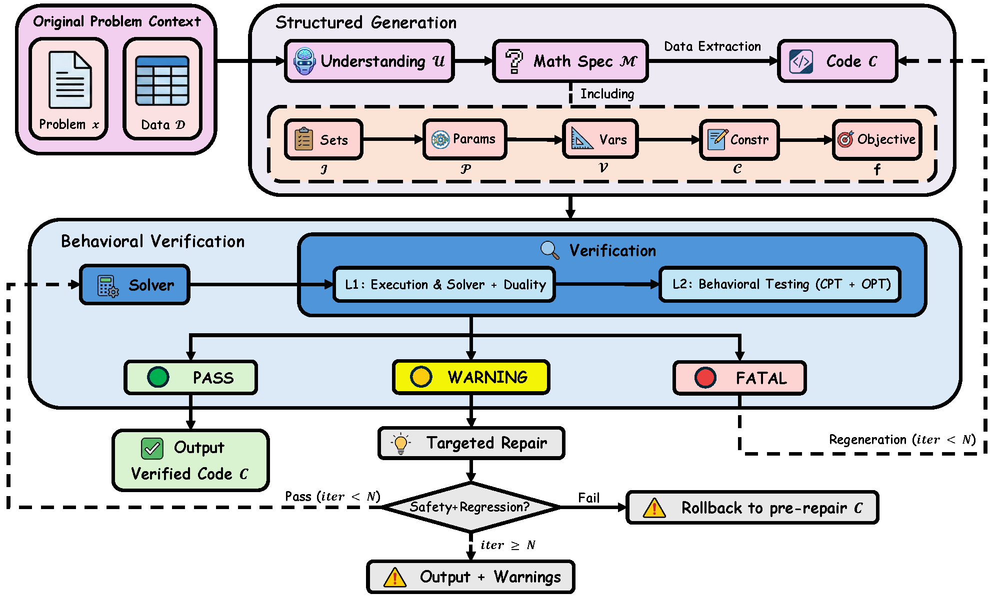

# ReLoop: Structured Modeling and Behavioral Verification for Reliable LLM-Based Optimization

[](https://neurips.cc/Conferences/2026)
[](https://arxiv.org/abs/2602.15983)
[](https://huggingface.co/datasets/Jacoblian/RetailOpt-190)
[](https://github.com/junbolian/RetailOpt-190)
[](https://www.python.org/downloads/)
[](https://opensource.org/licenses/MIT)

Official implementation of the NeurIPS 2026 paper:

> **ReLoop: Structured Modeling and Behavioral Verification for Reliable LLM-Based Optimization**
>
> Junbo Jacob Lian, Yujun Sun, Huiling Chen, Chaoyu Zhang, Hanzhang Qin, Chung-Piaw Teo
>
> *NeurIPS 2026*

| Resource | Link |
|----------|------|
| **Paper** | NeurIPS 2026 · [arXiv:2602.15983](https://arxiv.org/abs/2602.15983) |
| **RetailOpt-190 Dataset** | [Hugging Face](https://huggingface.co/datasets/Jacoblian/RetailOpt-190) · [GitHub](https://github.com/junbolian/RetailOpt-190) |
| **ReLoop Code** | [GitHub](https://github.com/junbolian/ReLoop) |

---

## TL;DR

LLMs can generate optimization code that *executes perfectly but solves the wrong problem*—**silent failures**. On compositional problems, we observe up to 91.1% solver-feasibility but only 0.5% correctness (a 90-point gap). ReLoop addresses this from two directions:

- **Structured generation**: a 4-stage reasoning chain (understand → formalize → synthesize → verify) that mirrors expert modeling practice
- **Behavioral verification**: solver-based perturbation testing that detects missing constraints and objective terms *without ground truth*

These two mechanisms are complementary by error structure: structured generation gives the largest gain on compositional problems (+8.5pp accuracy on RetailOpt-190 with Claude Opus 4.6, from 22.6% to 31.1%), while behavioral verification makes its largest contribution on MAMO-ComplexLP (+4.4pp with Claude Opus 4.6). With diagnostic execution recovery, the full pipeline raises execution on Claude Opus 4.6 from 72.1% to 100.0%. For narrowly fine-tuned SFT models, the chain-of-thought prompt conflicts with the learned output format and lowers accuracy; the paper documents this interaction.

---

## Framework

<p align="center">
  
</p>

**Structured Generation** decomposes code production into four stages executed in a single LLM call: (1) understand the problem, (2) formalize the mathematical model with explicit variable-type reasoning, (3) synthesize Gurobi code with data extraction, and (4) self-verify completeness. **Behavioral Verification** operates in two layers: L1 checks execution correctness with IIS-enhanced diagnostics (Fatal → regeneration); L2 tests constraint presence (CPT) and objective completeness (OPT) via solver-based perturbation (Warning/Pass). **Diagnosis-Guided Repair** targets only high-confidence issues with regression rollback protection.

---

## Main Results

### RetailOpt-190 (pass@1)

| Type | Model | Exec% ||| Acc% (ε=10⁻⁴) ||| Acc% (ε=10⁻²) |||
|------|-------|:---:|:---:|:---:|:---:|:---:|:---:|:---:|:---:|:---:|
| | | Base | CoT | ReLoop | Base | CoT | ReLoop | Base | CoT | ReLoop |
| Foundation | Claude Opus 4.6 | 72.1 | 93.7 | **100.0** | 22.6 | 31.1 | **31.1** | 26.8 | 34.7 | **35.3** |
| Foundation | DeepSeek-V3.2 | 91.1 | 53.2 | **97.4** | 0.5 | 3.7 | **5.8** | 3.7 | 5.8 | **11.1** |
| Foundation | Qwen3-32B | 0.0 | 0.0 | **2.1** | 0.0 | 0.0 | 0.0 | 0.0 | 0.0 | 0.0 |
| Offline SFT | OptMATH-Qwen2.5-32B | 2.6 | 2.6 | **17.9** | 0.0 | 0.0 | 0.0 | 0.0 | 0.0 | **0.5** |
| Online RL | SIRL-Qwen2.5-32B | 0.0 | 0.0 | **1.6** | 0.0 | 0.0 | 0.0 | 0.0 | 0.0 | 0.0 |

### Cross-Benchmark Generalization (Acc%, ε=10⁻⁶)

| Type | Model | MAMO-ComplexLP ||| IndustryOR |||
|------|-------|:---:|:---:|:---:|:---:|:---:|:---:|
| | | Base | CoT | +ReLoop | Base | CoT | +ReLoop |
| Foundation | Claude Opus 4.6 | 70.4 | 73.9 | **79.8** | 66.0 | 66.0 | **68.0** |
| Foundation | DeepSeek-V3.2 | 60.1 | 59.6 | **62.6** | 50.0 | 54.0 | **62.0** |
| Foundation | Qwen3-32B | 40.4 | 37.4 | **46.3** | 43.0 | 43.0 | **46.0** |
| Offline SFT | OptMATH-Qwen2.5-32B | **56.2** | 30.0 | 31.0 | **34.0** | 31.0 | **34.0** |
| Online RL | SIRL-Qwen2.5-32B | 53.2 | 46.8 | **54.2** | 40.0 | 40.0 | **43.0** |

### Ablation (pass@1)

| Config | Claude (RetailOpt) ||| DeepSeek (RetailOpt) ||| Claude (MAMO) || DeepSeek (MAMO) ||
|--------|:---:|:---:|:---:|:---:|:---:|:---:|:---:|:---:|:---:|:---:|
| | Exec | ε=10⁻⁴ | ε=10⁻² | Exec | ε=10⁻⁴ | ε=10⁻² | Exec | Acc | Exec | Acc |
| Direct | 72.1 | 22.6 | 26.8 | 91.1 | 0.5 | 3.7 | 94.1 | 70.4 | 93.6 | 60.1 |
| +CoT | 93.7 | 31.1 | 34.7 | 53.2 | 3.7 | 5.8 | 95.6 | 73.9 | 87.7 | 59.6 |
| +CoT+L1 | 99.5 | 31.1 | 35.3 | 97.4 | 5.8 | 10.5 | 98.0 | 75.4 | 88.7 | 60.6 |
| +CoT+L1+L2 | **100.0** | **31.1** | **35.3** | **97.4** | **5.8** | **11.1** | **98.0** | **79.8** | **88.7** | **62.6** |

> CoT is the primary accuracy driver on RetailOpt (+8.5pp for Claude); L1 dominates execution recovery (+44.2pp for DeepSeek); L2 is the largest single accuracy contributor on MAMO (+4.4pp for Claude). See the paper for full analysis.

---

## Installation

```bash
git clone https://github.com/junbolian/ReLoop.git
cd ReLoop
pip install -r requirements.txt
```

**Requirements:** Python ≥ 3.10 and Gurobi ≥ 11.0 with a valid license (free academic licenses are available from Gurobi).

---

## Quick Start

ReLoop talks to models through the OpenAI-compatible chat API, so it works with OpenAI, vLLM, Ollama, or any other OpenAI-compatible endpoint.

```bash
export OPENAI_API_KEY="your-api-key"
export OPENAI_BASE_URL="https://api.openai.com/v1"  # or your endpoint

# Full ReLoop pipeline (CoT + L1 + L2)
python run_ablation.py \
    -d data/RetailOpt-190.jsonl \
    -m gpt-4.1 \
    --enable-cpt \
    --workers 5 \
    -v
```

### CLI Options

| Flag | Default | Description |
|------|---------|-------------|
| `-d, --dataset` | *(required)* | Path to dataset JSONL |
| `-m, --model` | `gpt-4.1` | Model name (OpenAI SDK format) |
| `-o, --output-dir` | `experiment_results/<dataset>/<model>` | Output directory |
| `--base-url` | `$OPENAI_BASE_URL` | Single OpenAI-compatible endpoint |
| `--api-key` | `$OPENAI_API_KEY` | API key override (`EMPTY` for local servers) |
| `--enable-cpt` | off | Enable L2 behavioral testing (CPT + OPT) |
| `--no-cot` | off | Direct generation baseline (skip CoT) |
| `--no-verify` | off | CoT-only baseline (skip verification) |
| `--workers` | 20 | Concurrent workers |
| `--local` | off | Local mode (default endpoint `http://127.0.0.1:8000/v1`) |
| `--base-urls` | — | Comma-separated endpoints for multi-GPU load balancing |
| `-v` | off | Verbose logging |

### Local Model Deployment

```bash
# Deploy a local model via vLLM
python scripts/deploy_local_llm.py \
    --model qwen3-32b \
    --backend vllm \
    --gpus 4,5,6,7 \
    --port 8000

# Run against local endpoint
python run_ablation.py \
    -d data/RetailOpt-190.jsonl \
    -m Qwen3-32B \
    --local --enable-cpt --workers 5 -v
```

### Python API

```python
from reloop import run_reloop

result = run_reloop(
    problem_description="...",
    data=data,
    llm_client=llm_client,
    verbose=True
)
print(f"Status: {result.final_report.status}")   # VERIFIED / WARNINGS / ERRORS / FAILED
print(f"Objective: {result.final_report.objective}")
```

---

## Datasets

| Dataset | File | Instances | Avg Tokens | Tolerance | Source |
|---------|------|:---------:|:----------:|:---------:|-------|
| RetailOpt-190 | `data/RetailOpt-190.jsonl` | 190 | ~2,900 | 10⁻⁴ / 10⁻² | Ours |
| MAMO-ComplexLP | `data/MAMO_ComplexLP_fixed.jsonl` | 203 | ~459 | 10⁻⁶ | [Huang et al., 2024](https://github.com/FreedomIntelligence/Mamo) |
| IndustryOR | `data/IndustryOR_fixedV2.jsonl` | 100 | ~267 | 10⁻⁶ | [Huang et al., 2025](https://huggingface.co/datasets/CardinalOperations/IndustryOR) |

All datasets are stored as JSONL (one problem per line). The tolerance is the relative error allowed when comparing an objective value against the ground truth; `run_ablation.py` selects it automatically from the dataset name.

---

## Project Structure

```
ReLoop/
├── reloop/                        # Core package
│   ├── __init__.py                # Public API exports
│   ├── pipeline.py                # Full generate → verify → repair orchestration
│   ├── generation.py              # 4-stage structured code generation
│   ├── verification.py            # L1 execution + L2 behavioral testing (CPT/OPT)
│   ├── repair.py                  # Diagnosis-guided repair with regression guard
│   ├── repair_safety.py           # Safety guardrails for repair outputs
│   ├── executor.py                # Sandboxed execution with IIS/ray diagnostics
│   ├── experiment_runner.py       # Batch experiment runner
│   ├── param_utils.py             # Data-dict perturbation engine
│   ├── perturbation.py            # AST-based source-code perturbation (fallback)
│   ├── prompts.py                 # All LLM prompt templates
│   └── data_extraction.py         # NL → structured JSON extraction
├── data/                          # Benchmark datasets (JSONL)
├── fig/                           # Framework diagram
├── scripts/                       # Deployment & automation
│   ├── deploy_local_llm.py        # Launch vLLM / llama.cpp server
│   └── run_all_local_ablation.sh  # Batch ablation for local models
├── run_ablation.py                # Main experiment entry point
├── analyze_layers.py              # Per-layer contribution analysis
├── requirements.txt               # Core dependencies
├── requirements.local-inference.txt  # Optional: vLLM / llama.cpp
├── pyproject.toml                 # Project metadata
└── LICENSE                        # MIT
```

---

## Citation

```bibtex
@inproceedings{lian2026reloop,
  title     = {{ReLoop}: Structured Modeling and Behavioral Verification for Reliable {LLM}-Based Optimization},
  author    = {Lian, Junbo Jacob and Sun, Yujun and Chen, Huiling and Zhang, Chaoyu and Qin, Hanzhang and Teo, Chung-Piaw},
  booktitle = {Advances in Neural Information Processing Systems},
  year      = {2026},
  url       = {https://arxiv.org/abs/2602.15983}
}
```

## License

MIT License. See [LICENSE](LICENSE) for details.

## Acknowledgments

We thank the developers of [Gurobi](https://www.gurobi.com/), [MAMO](https://github.com/FreedomIntelligence/Mamo), [IndustryOR](https://huggingface.co/datasets/CardinalOperations/IndustryOR), [OptMATH](https://github.com/optsuite/OptMATH), and [SIRL](https://github.com/Cardinal-Operations/SIRL) for making their code and data publicly available!
